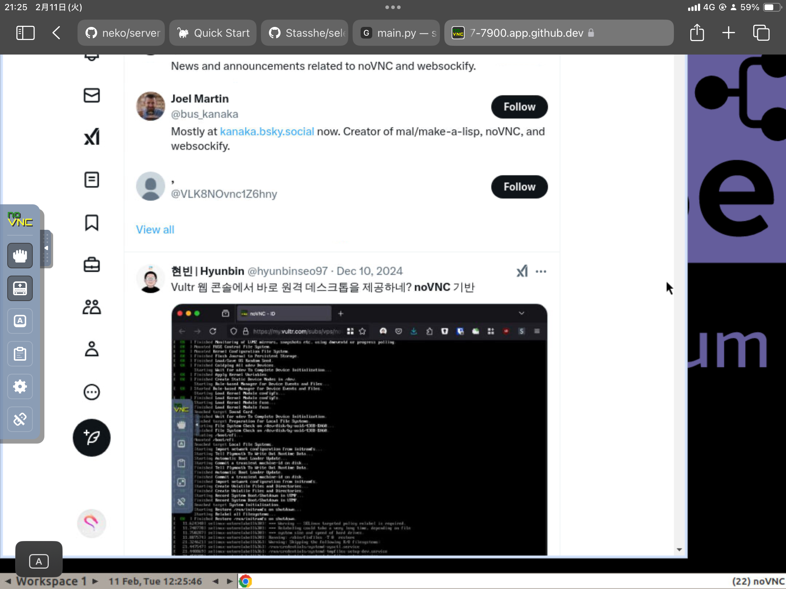

# Selenium Docker Setup Guide


## 1. Open Codespaces
Launch your GitHub Codespaces environment.

## 2. Run the Docker Container
Copy and paste the following code into your terminal:

```bash
docker run -d --name selenium \
  -p 4444:4444 -p 7900:7900 \
  --shm-size=4g \
  -e SE_NODE_SESSION_TIMEOUT=3000 \
  -e SCREEN_WIDTH=1280 \
  -e SCREEN_HEIGHT=720 \
  -e SCREEN_DEPTH=24 \
  selenium/standalone-chrome
```

## 3. Verify Codespaces
Once you see something like `USERNAME@workspaces/(main)`, you're ready for the next step.

## 4. Install Selenium
Run the following commands in your terminal:

```bash
pip install selenium
```

```bash
python main.py
```

## 5. Access the Selenium Server
Open your browser and go to `localhost:7900`. 
Note: Port `4444` is for managing Selenium and usually doesn't need to be opened.

## 6. Authenticate with noVNC
When the noVNC authentication page opens, enter the following password:

```
secret
```
and click "Connect".

## 7. (Optional) Adjust VNC Quality
For better performance, you can adjust the VNC quality settings:
- Quality: 2
- Compression: 8

## 8. Restart the Browser
If the browser suddenly closes, simply rerun:

```bash
python main.py
```

## 9. Stop Codespaces
Remember to stop your Codespaces when you're done to avoid hitting the monthly time limit on the free plan.

## 10. Enjoy!
You are now ready to use Selenium with Docker in your Codespaces environment!
